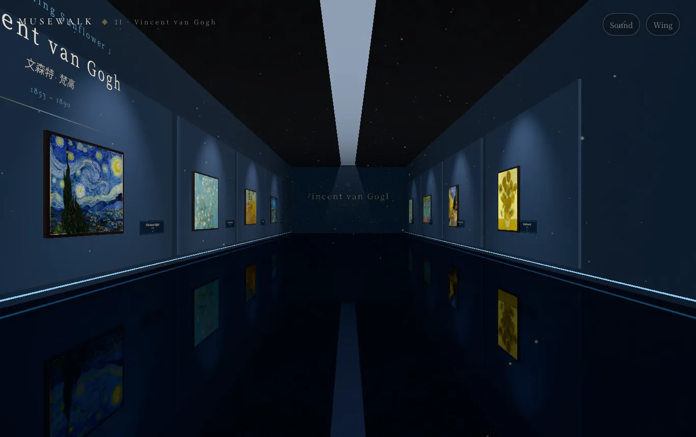
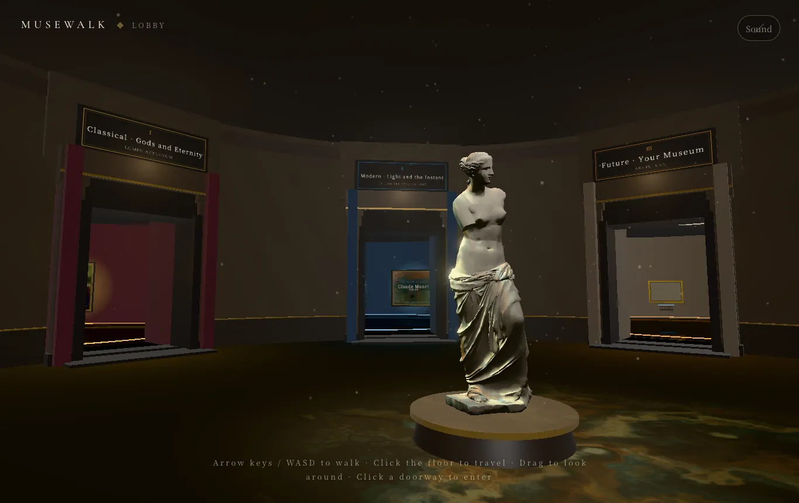
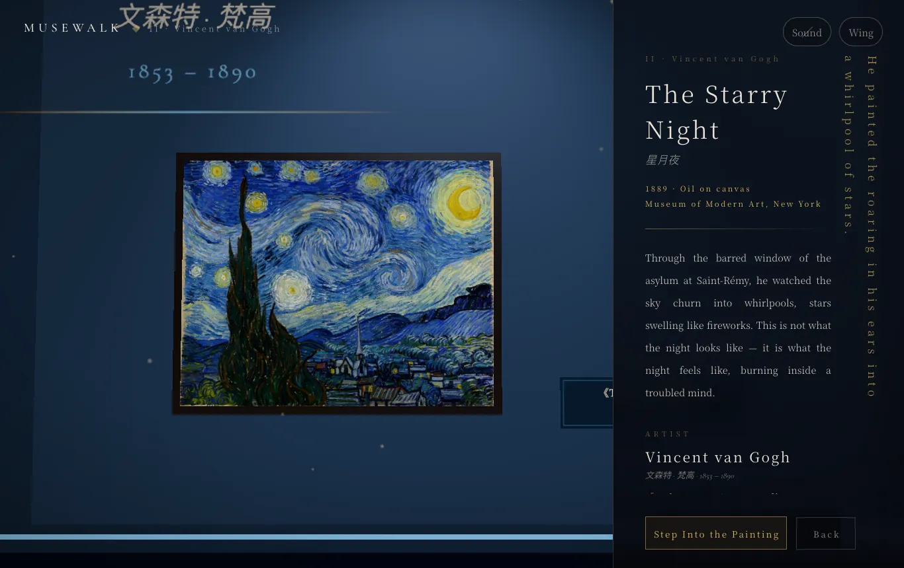
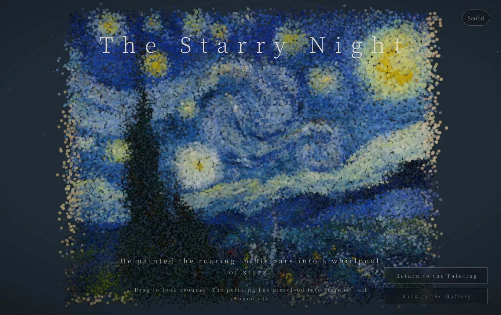

<div align="center">

# Musewalk（入画）· 可漫游的 3D 美术馆引擎

### 走进一座活在浏览器标签页里的美术馆。
**站在大师真迹前 —— 然后，走进画布里。**

*一个图片文件夹 + 一份 JSON = 一座属于你的沉浸式 3D 美术馆。*
*无后端 · 无账号 · 不写代码。*

[](LICENSE)
[](https://github.com/shuyan-5200/musewalk/actions/workflows/ci.yml)
[](https://threejs.org)
[](#-技术实现)
[](#-参与共建)
[](https://stackblitz.com/github/shuyan-5200/musewalk)

### ▶&nbsp;&nbsp;在线 Demo —— 随首次公开发布上线

<sub>无需安装 · 浏览器直接打开</sub>

[English](README.md) · [中文](README.zh-CN.md)



</div>

---

- 🚶 **第一人称漫游** —— WASD、点击地面前往、拖拽环顾
- 🖼️ **36 幅名作，开箱即看** —— 从达·芬奇到梵高，全部公有领域
- 🌌 **走进任意一幅画** —— 它会化作约 5 万颗漂浮的粒子
- 🪄 **原画与笔触浮雕** —— 进入画境默认先看原作；主动点「立体画境」后，画布才升起为笔触碎片
- 🔇 **音乐由你决定** —— 默认关闭，从落地页、大厅、画境到星尘都可以随时开关
- 🧩 **100% 配置驱动** —— 整座美术馆就是一份 JSON，零代码
- ⚡ **无需后端** —— 纯静态站点，几分钟部署到任何地方

## 这是什么？

**Musewalk** 把一个图片文件夹变成一座**可以漫步的 3D 美术馆**，完全跑在浏览器里。穿过穹顶圆厅，推门进入古典、现代、未来三座主题馆，聚焦一幅画品读它的故事 —— 然后**径直走进它**，漂浮在笔触化开的色彩之中。

你看到的一切 —— 展厅、艺术家、题签、连那束光的情绪 —— 都来自一份 `gallery.config.json`。改这份文件，就是另一座美术馆。**你永远不用碰 3D 代码。**

## ✨ 三个让它与众不同的瞬间

| 🚶 走进去 | 🔍 聚焦品读 | 🌌 走入画中 |
| :---: | :---: | :---: |
|  |  |  |
| 一个连续空间 —— 圆厅 + 三座主题馆 —— 沉稳丝滑的第一人称移动。 | 相机缓缓推近取景，侧栏面板讲述每幅作品的故事。 | 招牌一刻：画作碎成**约 5 万颗粒子**，你漂浮着穿过那片色彩。 |

## 🚀 快速开始

需要 Node.js 20.19 或更高版本。

```bash
git clone https://github.com/shuyan-5200/musewalk.git
cd musewalk
npm install
npm run dev      # → http://localhost:5173
npm run check    # 检查你自己的美术馆配置、资源与 ID
npm run build    # 产物在 dist/
```

Demo 自带 **36 幅公版大师名作**，一打开就是一座完整的美术馆。

项目维护者在发布官方 Demo 前运行 `npm run release:check`；它会在通用检查之外增加空未来馆、隐私、画作来源、公开截图复核和资产许可门禁。

## 🎨 打造你自己的美术馆

整座美术馆都是数据。要做一座自己的，通常完全不用碰渲染代码：

1. 把你的图片放进 `public/art/`。
2. 在 `public/gallery.config.json` 里描述你的馆。

```jsonc
{
  "title": "MY GALLERY",
  "wings": [
    {
      "id": "modern", "name": "现代", "type": "collection",
      "wall": "#1b1d24", "accent": "#c9a86a",
      "artists": [
        {
          "id": "vangogh", "name": "文森特·梵高",
          "works": [
            { "id": "starry-night", "file": "art/starry-night.jpg", "title": "星月夜",
              "year": "1889", "desc": "沉睡村庄上空，星河翻涌。",
              "wide": true }
          ]
        }
      ]
    },
    {
      "id": "future", "name": "你的展馆", "type": "open", "frames": 6
    }
  ]
}
```

- **`"type": "collection"`** —— 每位艺术家生成一个画屏入口，点进去是他的专属展廊。
- **`"type": "open"`** —— 真实作品与空金框混排（`"frames": N`）。非常适合做一个「你的作品挂这里」的展馆。
- **未来馆发布基线** —— 内置公版 Demo 特意保持为空：6 个金框，0 位艺术家，0 幅作品。
- **氛围** —— 墙色、画框样式、灯光、雾，可按馆、按艺术家逐级配置。
- **热切换配置** —— 什么都不用改，临时试另一座馆：`?config=my.json`。
- **中文 demo** —— 浏览器语言是中文时自动打开中文版（由 `altLang.lang: "zh"` 控制）；也可以点落地页右上角的切换，或追加 `?config=gallery.config.zh.json`。
- **mini demo** —— 追加 `?config=gallery.config.mini.json`，只加载梵高 6 幅，更适合在线沙盒。

## 🧱 技术实现

- **[three.js](https://threejs.org)** 渲染 · **[camera-controls](https://github.com/yomotsu/camera-controls)** 提供丝滑第一人称手感 · **[Vite](https://vitejs.dev)** 开发与构建。
- **无后端、无数据库**。运行时代码只有上面两个库；字体通过 [Fontsource](https://fontsource.org) 随站点自托管，不请求任何第三方服务，国内也能正常加载。
- 环境音由 Web Audio API **实时合成** —— 没有任何音频文件。
- `scripts/verify.mjs` 用**无头 Chrome 真实点击巡检**（12 站），对意外跳页、音乐、入场移动、画境模式、资源和控制台错误执行可失败断言。

## 📦 目录结构

```
public/
  gallery.config.json   美术馆配置（馆/艺术家/画作/文案）—— 改这里
  art/                  画作图片
src/
  appVariant.js  公版适配边界（中性雕塑）
  data.js        配置装载与规范化
  main.js        状态机与交互路由
  lobby.js       圆厅 + 各馆 + 门洞
  hall.js        艺术家专属展廊生成器
  dream.js       画境：默认原画 → 可选笔触浮雕
  dreamBodies/strokes.js 唯一生产浮雕渲染器
  immersion.js   「走入画中」粒子沉浸
  fx.js          辉光 / 漂浮尘埃 / 光锥
  audio.js       Web Audio 环境音景
  ui.js          全部 DOM 界面
scripts/
  fetch_art.py   从 Wikimedia Commons 下载经许可核验的馆藏
  check-config.mjs 配置、资源、ID、软链接与双语结构一致性
  check-privacy.mjs 官方发布隐私扫描
  check-release-assets.mjs 核验画作/截图记录并阻断许可未明确的资产
  verify.mjs     12 站真实点击巡检 + 截图
```

## 🖼️ 扩展馆藏

内置 demo 精选了 36 幅公版名作，图片已压到 web 分辨率以便快速 clone。想要从 Wikimedia Commons 拉取更完整的图片集（断点续传、限流退避）：

```bash
python scripts/fetch_art.py
```

下载前，脚本会通过 Commons API 逐个核对文件，只接受
`LicenseShortName` 明确标为 `Public domain`、`CC0` 或 `CC BY` 的条目；
`SA`、`NC` 及许可不明的结果即使排在搜索第一也会被拒绝。每个通过的
JPEG 都会写入 `public/art/sources.manifest.json`，记录本地哈希、规范的
Commons 说明页、实际文件名、许可，以及 `extmetadata` 中的
`Artist` / `Credit`。提交图片时请一起提交这份清单。

只给现有图片补齐来源、不下载缺失画作时，运行
`python scripts/fetch_art.py --metadata-only`；加 `--only WORK_ID` 可只检查或拉取一幅。

取回图片后，把想展示的作品加回 `public/gallery.config.json` 即可。配置驱动的好处就在这里：引擎不用改，美术馆可以继续生长。

## 🤝 参与共建

欢迎 Issue 和 PR —— 新的展馆主题、移动端优化、配置能力、性能改进。**如果你用它搭了一座美术馆，开个 Issue 来炫一下。**

## 📄 许可与致谢

源代码采用 **[MIT](LICENSE)**；Demo 资产沿用各自条款：36 幅画作和大厅中央的《米洛的维纳斯》扫描（来自丹麦国家美术馆 SMK）都属于公有领域。每项来源与署名见 **[CREDITS.md](CREDITS.md)**。

---

<div align="center">

*一直走，走进画里。那才是最妙的部分。*

⭐ **如果它让你会心一笑，点个 star 能帮更多人发现它。**

</div>
